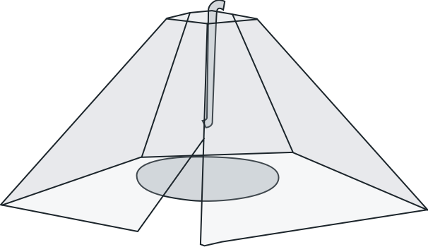

<p align="center">
  
</p>
<h1 align="center">Periscope</h1>

<p>&nbsp;</p>

## Setup

If you cloned the repo from the command line, you need to install the openFrameworks submodule:

```sh
git submodule init
git submodule update
```

Run `./setup.sh` to download dependencies.
